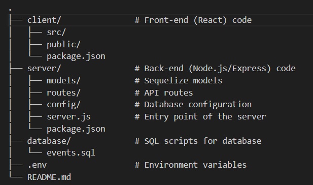

# EventManagementSystem
The Event Management System is a web-based application developed to ease the planning, viewing, and signing up for events. It allows organizers to create and manage events, while users can explore, filter, and register for various events. The application is built using a modern technology stack including React for the front end, Node.js for the back end, and MySQL for the database.

# Features
Event Listings: Display a list of upcoming events with filtering options.

Event Creation: Authorized users can create, update, or delete events.

User Authentication: OAuth2-based login for secure access.

Event Registration: Users can register for events and get notifications.

Image Upload: Organizers can upload event-related images.

Responsive Design: Optimized for desktop and mobile views.

# Technologies
Front-End: React, Axios, CSS

Back-End: Node.js, Express, Sequelize

Database: MySQL

Authentication: OAuth2, JWT (JSON Web Tokens)

Image Uploads: Multer for handling image uploads

Hosting: Platforms like Netlify for the front end, Heroku for the back end

# Prerequisites
To run this project, you'll need the following software installed:

Node.js (v14 or higher)

MySQL (v8 or higher)

Git (for version control)

# Ensure you have the following tools:

npm (comes with Node.js)

MySQL Server (with a database created for the application)

Setup Instructions

1. Clone the Repository

git clone https://github.com/your-repository-url/EventManagementSystem.git

cd EventManagementSystem

2. Set Up MySQL Database

Create a new MySQL database called ems (or use the name provided in config.json):

mysql

CREATE DATABASE ems;

Import the events.sql file into your MySQL database:

mysql -u your_username -p ems < /path/to/events.sql

3. Configure Environment Variables

Create a .env file in the root directory and add the following configurations:

.env

NODE_ENV=development

PORT=3000

DB_HOST=localhost

DB_USER=your_username

DB_PASSWORD=your_password

DB_NAME=ems

JWT_SECRET=your_jwt_secret

4. Install Dependencies

Install all the required dependencies for both front end and back end:

npm install

5. Run Database Migrations (Optional)

If using Sequelize migrations, run the following command to sync your models:

npx sequelize db:migrate

# Running the Application

1. Start the Back-End Server

Navigate to the back-end folder and start the Node.js server:

npm start

2. Start the Front-End Development Server

Navigate to the front-end folder and start the React development server:

npm start

3. Access the Application

Open your browser and go to http://localhost:3000 to view the application.

API Documentation

The API follows RESTful standards and includes the following key routes:

# Event Endpoints:

GET /api/events: Retrieve all events.

POST /api/events: Create a new event.

PUT /api/events/

: Update an existing event.

DELETE /api/events/

: Delete an event.

For more detailed documentation, you can refer to the Swagger API documentation included in the repository.

# Project Structure

.
├── client/               # Front-end (React) code
│   ├── src/
│   ├── public/
│   └── package.json
├── server/               # Back-end (Node.js/Express) code
│   ├── models/           # Sequelize models
│   ├── routes/           # API routes
│   ├── config/           # Database configuration
│   ├── server.js         # Entry point of the server
│   └── package.json
├── database/             # SQL scripts for database
│   └── events.sql
├── .env                  # Environment variables
└── README.md

# Contributing

Contributions are welcome! Please create a pull request with detailed information regarding changes.
